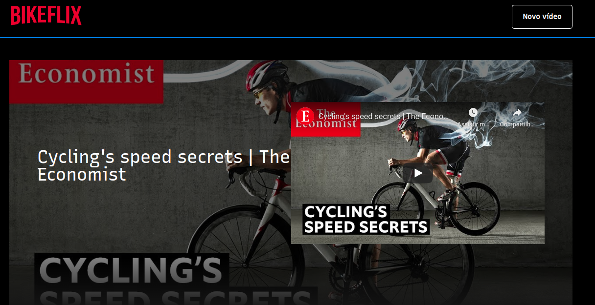

Plataforma para visualização de vídeos relativos a ciclismo.
Desenvolvido por Marianne durante a Imersão React da Alura.

Executar o projeto
Instalar Node e executar com o gerenciador de pacotes

# Para usuários de npm
npm i
npm run dev
# ou para usuários yarn
yarn
yarn dev

O projeto disponível em http://localhost:3000 com o servidor de dados em http://localhost:8080/categorias e http://localhost:8080/videos